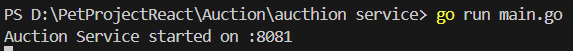

Лабораторная работа №5 Кузьмин Антон, 8К22

В ходе лабораторной работы было реализованно два микросервиса Auction и User.
Для наглядной демонстрации работы двустороннего обмена информации была реализована логика 
1) проверки аукционом корректность seller_id
2) проверки аукционом баланса определенного пользователя 

Запускаем микросервисы 

Два микросервиса работают на разных портах 8081 для аукциона и 8080 для пользователя

Попытаемся создать аукицонный лот без пользователя 

Создаем пользователя 

Создаем нового пользователя и лот аукциона , 

Попробуем поставить ставку и проверить баланс пользователя , 
